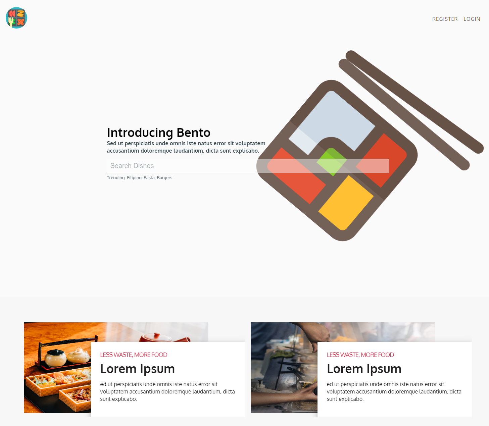
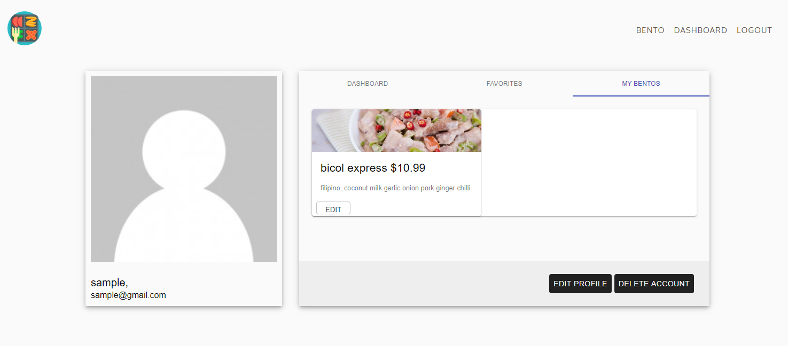
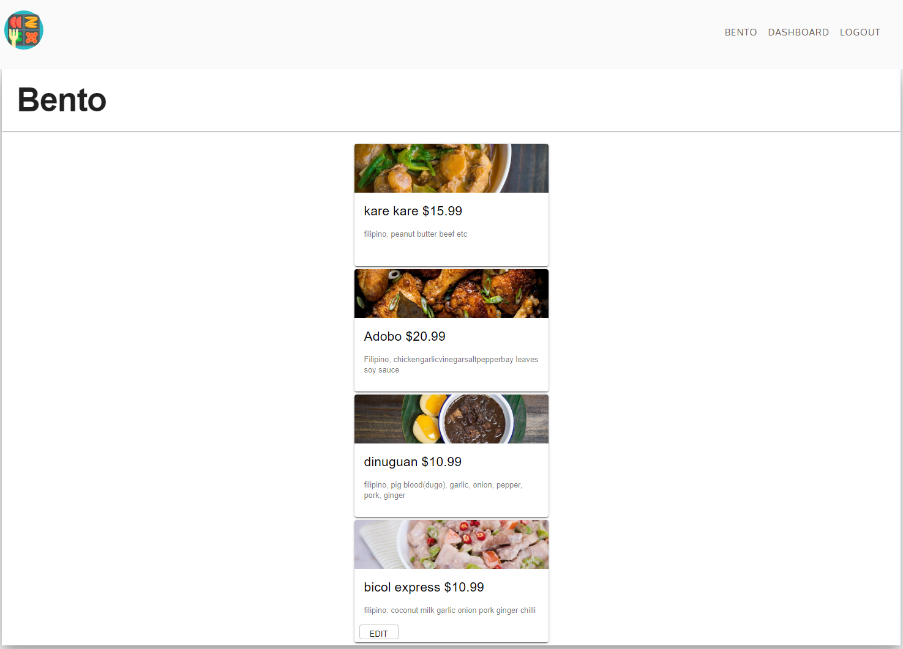

# ben-to

    Bento is a Lunchbox Marketplace concept that helps homecooks sell homecooked Meals.

### Motivation

    this app is aimed towards students or office workers who are tired of eating fastfood every. The idea is for
    small pop-ups to set-up a small shop with pre-packaged homemade meals that is ordered through the app.

### Technologies

    Built with Material UI, React.js, React-redux, Auth-0, MongoDB, Node.js, Express.js

### Screenshots

    
    
    
